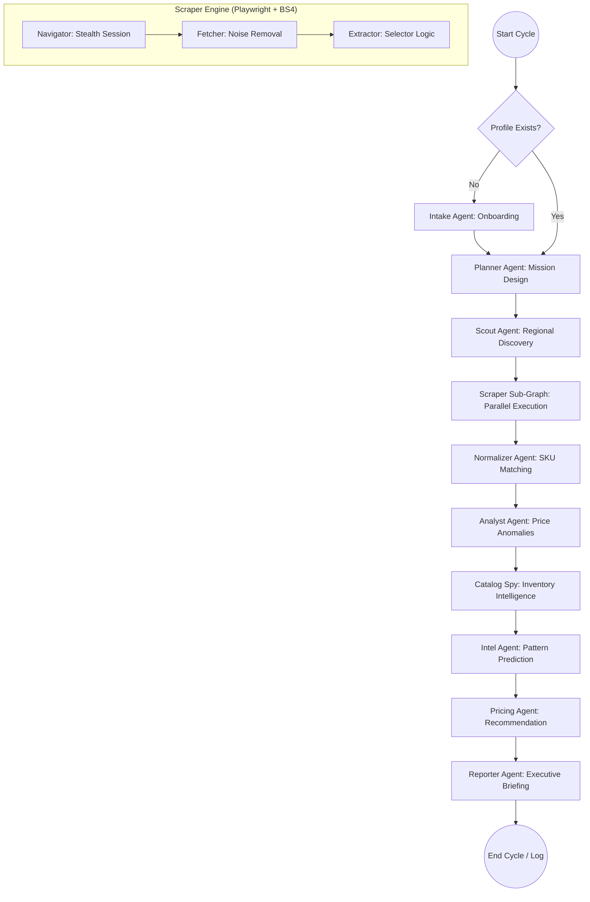

# RetailAgent — LangChain + LangGraph Market Intelligence

## 🚀 Overview
RetailAgent is an autonomous, multi-agent AI framework designed for enterprise-grade competitor monitoring and pricing strategy. It operates as a state-aware reasoning engine that identifies competitors, stabilizes its own browser sessions, matches products via AI embeddings, and detects long-term market trends.

## 🛠️ Stabilized Core Architecture
The system is hardened for high-scale retail operations:
*   **Navigation Resilience**: Uses `wait_until="commit"` and autonomous recovery to bypass heavy scripts on Amazon/Flipkart.
*   **Fuzzy Product Matching**: Implements `SequenceMatcher` logic (75% threshold) to handle slight name variations.
*   **Zero-Noise Intelligence**: A 7-layer verification pipeline ensures "Discontinued" alerts are only issued for products missing for 7+ days.

---

## 🗄️ Database Architecture: The "Live Ledger"
The agent uses a **persistent, incremental update pattern**. It doesn't wait for the cycle to end to save data; it updates the database at every stage.

| Table | Agent | Purpose |
| :--- | :--- | :--- |
| `competitor_catalog` | CatalogSpy | **Inventory Memory**: Tracks historical sightings and stock-out frequency. |
| `price_history` | Analyst | Log of every price change for predictive trend analysis. |
| `scraped_data` | Scraper | Raw harvest data cached mid-cycle for resilience. |
| `product_catalog` | Pricing | Your internal SKU list and auto-applied price updates. |

---

## 🕵️ Troubleshooting: Reading the Intel Logs
When an agent reports `0 records found`, use this guide to diagnose:

1.  **"The Scraper is Blind"**: 
    *   *Log:* `Results HTML captured (800,000+ chars)` but `0 matches found`.
    *   *Meaning:* The page loaded fine, but the CSS selectors are outdated. Fix `SITE_SELECTORS` in `extractor.py`.
2.  **"Site is Blocking"**:
    *   *Log:* `Results wait timed out — using what loaded`.
    *   *Meaning:* The site is too slow or detected the bot. Navigator needs more wait time or a fresh Proxy.
3.  **"Item is Missing"**:
    *   *Log:* `DOM Tester suggested: h2.sorry-txt`.
    *   *Meaning:* The website explicitly displayed a "No Results" message. The item is truly not in their catalog.

---

## 🗺️ Roadmap
- [x] **v1.0 Stable**: Autonomous scraping and intelligence pipeline.
- [ ] **v1.1 API Layer**: FastAPI wrapper for LangGraph cycle management.
- [ ] **v1.2 Scale**: Transition from SQLite to **MongoDB** for schemaless, high-volume JSON storage.
- [ ] **v1.3 Dashboard**: Next.js + Shadcn UI Command Center.

---
*Built for the next generation of Retail Intelligence.*